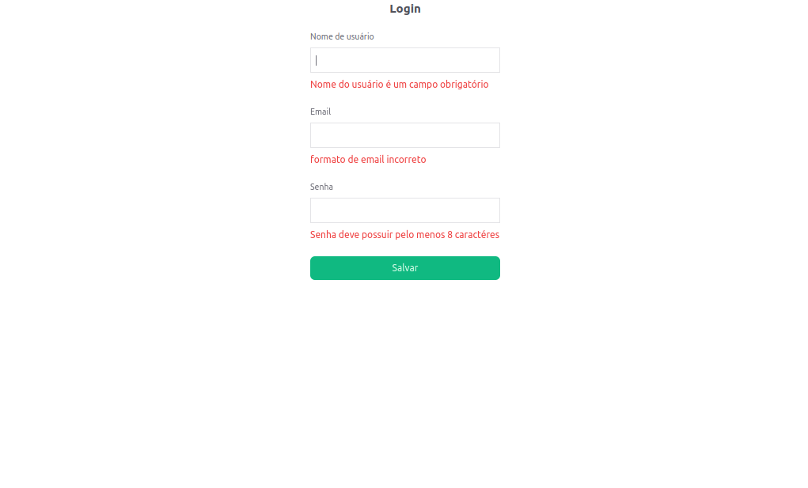

# Projeto React com Vite, Tailwind CSS, Zod, React Hook Form e Validadores

Este é um projeto React básico que utiliza o Vite como bundler, o Tailwind CSS para estilização, o Zod para validação de esquemas de dados, o React Hook Form para gerenciamento de formulários e os validadores do React Hook Form para validação de formulários.

## Estrutura do Projeto

- `src/`
  - `App.tsx`: Componente principal que renderiza o aplicativo.

## Dependências

- [Vite](https://vitejs.dev/)
- [Tailwind CSS](https://tailwindcss.com/)
- [Zod](https://github.com/colinhacks/zod)
- [React Hook Form](https://react-hook-form.com/)
- [hookform/resolvers](https://github.com/react-hook-form/resolvers?tab=readme-ov-file)

## Como Executar o Projeto

1. Certifique-se de ter o Node.js e o npm instalados.
2. Clone este repositório.
3. Instale as dependências executando `npm install`.
4. Navegue até a path `cd react-hook-form`
4. Inicie o servidor de desenvolvimento com `npm run dev`.

## Descrição do Código

### `App.tsx`

Este é o componente principal que renderiza o aplicativo. Ele contém o formulário de login e exibe os dados de entrada quando o formulário é submetido.

O formulário é gerenciado pelo React Hook Form, que utiliza o Zod Resolver para validar os dados de entrada de acordo com o esquema definido em `LoginForm.tsx`.

## Como Contribuir

Se você quiser contribuir para este projeto, sinta-se à vontade para abrir uma issue ou enviar um pull request no repositório do GitHub.

